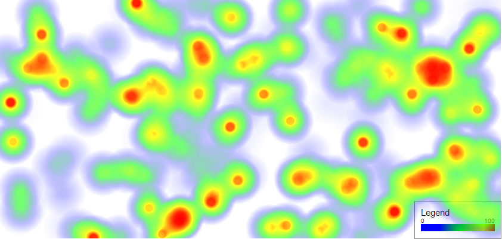

# Heatmap Playground

This is a simple example demonstrates how people can create heatmap
with legend by using the [heatmap.js](https://www.patrick-wied.at/static/heatmapjs/) JavaScript library.

## Step by step instructions

This is a step by step instruction demonstrates how to create a simplest
heatmap by using the heatmap.js.

1. Create element in DOM
```html
<div id="heatmapContainer" class="heatmap"></div>
```

2. Set width and height
```css
.heatmap {
  width: 840px;
  height: 400px;
  margin: auto;
}
```

3. Initiate and create the heatmap
```javascript
var heatmap = h337.create({
  container: document.getElementById("heatmap")
});

// setData removes all previously existing points from the heatmap instance
// and re-initializes the datastore.
heatmap.setData({
  max: 5,
  data: [
    {
      x: 10, // x coordinate of the datapoint, a number
      y: 15, // y coordinate of the datapoint, a number
      value: 5 // the value at datapoint(x, y)
    }
  ]
});
```

## Demo

This is a demo result generated by the source code in this repository.


